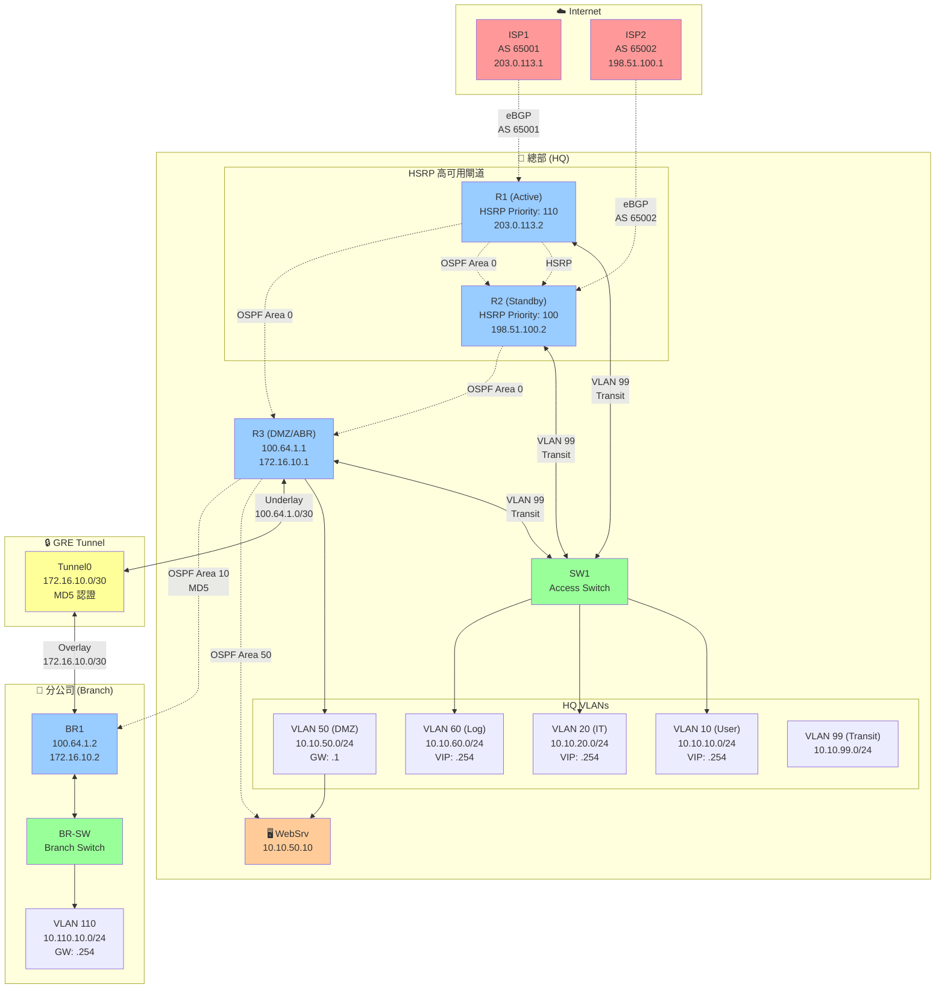
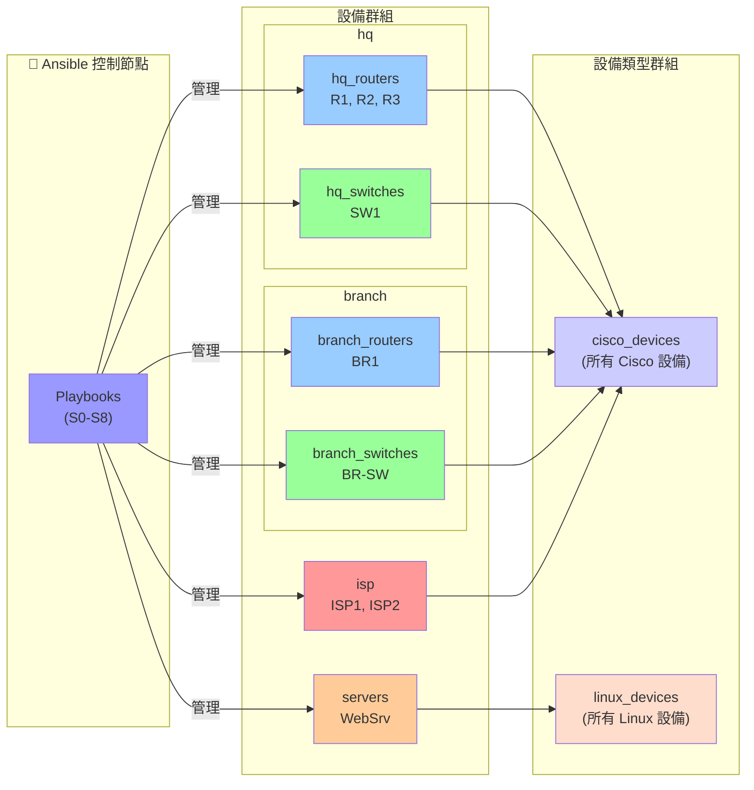
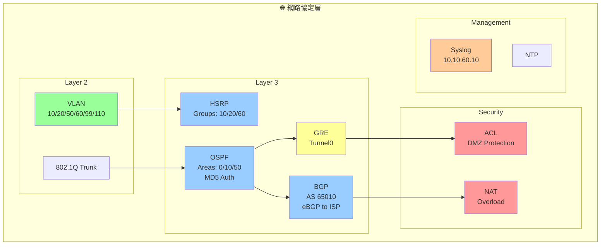
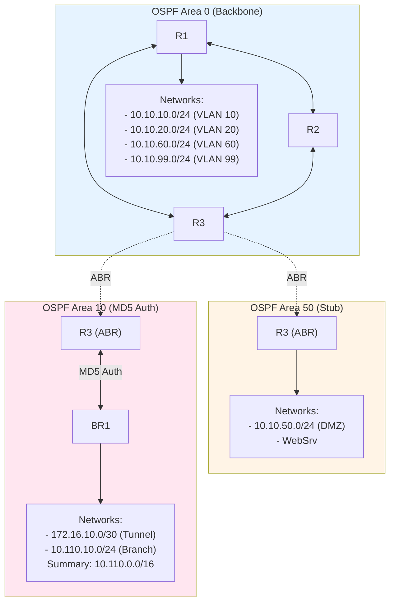
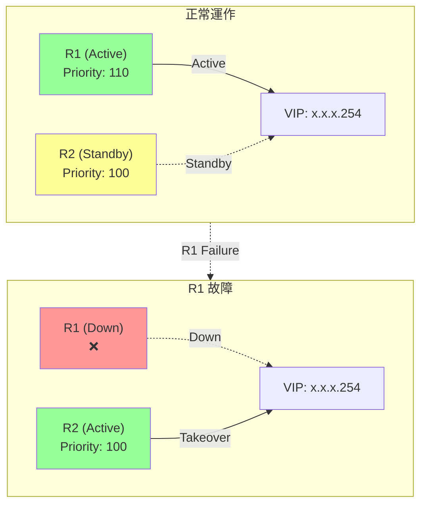
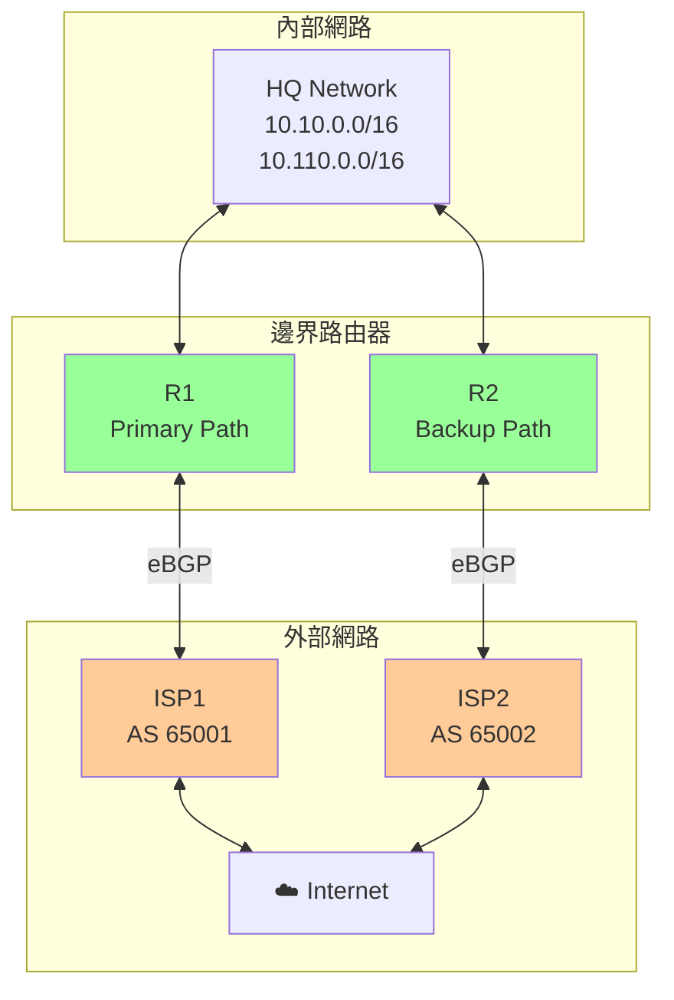
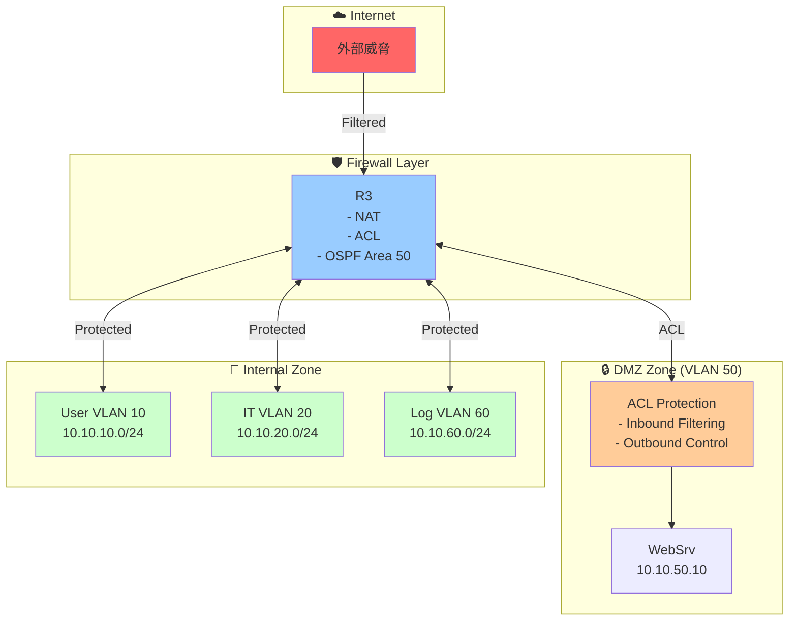

# Ansible Network Lab 架構圖

## 網路拓撲架構

## Ansible 主機清單架構

## 設備詳細資訊

### 總部 (HQ) 設備

| 設備 | 管理 IP | 角色 | 功能 |
|------|---------|------|------|
| **R1** | 192.168.1.11 | HSRP Primary | - HSRP Active (Priority 110) - eBGP to ISP1 - OSPF Area 0 - VLAN 10/20/60 網關 |
| **R2** | 192.168.1.12 | HSRP Standby | - HSRP Standby (Priority 100) - eBGP to ISP2 - OSPF Area 0 - VLAN 10/20/60 網關 |
| **R3** | 192.168.1.13 | DMZ/ABR | - OSPF ABR (Area 0/10/50) - GRE Tunnel Endpoint - DMZ 網關 - NAT & ACL |
| **SW1** | 192.168.1.21 | Access Switch | - VLAN 10/20/50/60/99 - Trunk to R1/R2/R3 |

### 分公司 (Branch) 設備

| 設備 | 管理 IP | 角色 | 功能 |
|------|---------|------|------|
| **BR1** | 192.168.1.14 | Branch Router | - GRE Tunnel Endpoint - OSPF Area 10 - VLAN 110 網關 |
| **BR-SW** | 192.168.1.22 | Branch Switch | - VLAN 110 Access - Trunk to BR1 |

### ISP 設備

| 設備 | 管理 IP | AS 號碼 | 功能 |
|------|---------|---------|------|
| **ISP1** | 192.168.1.31 | AS 65001 | eBGP Peer with R1 |
| **ISP2** | 192.168.1.32 | AS 65002 | eBGP Peer with R2 |

### 伺服器

| 設備 | 管理 IP | 內部 IP | 角色 |
|------|---------|---------|------|
| **WebSrv** | 192.168.1.41 | 10.10.50.10 | DMZ Web 伺服器 |

## 網路協定架構

## OSPF 區域架構

## IP 地址分配表

### HQ VLANs

| VLAN | 名稱 | 網段 | 網關/VIP | HSRP Group |
|------|------|------|----------|------------|
| 10 | User | 10.10.10.0/24 | 10.10.10.254 | 10 |
| 20 | IT | 10.10.20.0/24 | 10.10.20.254 | 20 |
| 50 | DMZ | 10.10.50.0/24 | 10.10.50.1 (R3) | - |
| 60 | Log | 10.10.60.0/24 | 10.10.60.254 | 60 |
| 99 | Transit | 10.10.99.0/24 | - | - |

### Branch VLANs

| VLAN | 名稱 | 網段 | 網關 |
|------|------|------|------|
| 110 | Branch-LAN | 10.110.10.0/24 | 10.110.10.254 (BR1) |

### Point-to-Point Links

| 連接 | 網段 | R1/R3 IP | R2/BR1/ISP IP |
|------|------|----------|---------------|
| R1 - ISP1 | 203.0.113.0/30 | 203.0.113.2 | 203.0.113.1 |
| R2 - ISP2 | 198.51.100.0/30 | 198.51.100.2 | 198.51.100.1 |
| R3 - BR1 (Underlay) | 100.64.1.0/30 | 100.64.1.1 | 100.64.1.2 |
| R3 - BR1 (Tunnel) | 172.16.10.0/30 | 172.16.10.1 | 172.16.10.2 |

## Ansible 部署流程

```mermaid
graph LR
    S0["S0: 準備與基線<br/>- Hostname<br/>- Logging<br/>- Basic Config"]
    S1["S1: HQ VLAN & HSRP<br/>- VLANs 10/20/60<br/>- HSRP Config"]
    S2["S2: DMZ & R3<br/>- VLAN 50<br/>- R3 Integration"]
    S3["S3: OSPF Summary<br/>- Area 0/50 Config<br/>- Route Summary"]
    S4["S4: GRE Tunnel<br/>- Underlay Config<br/>- Tunnel0 Setup"]
    S5["S5: Branch LAN<br/>- VLAN 110<br/>- BR1 Config"]
    S6["S6: eBGP<br/>- BGP to ISPs<br/>- Route Advertisement"]
    S7["S7: NAT & ACL<br/>- NAT Overload<br/>- DMZ ACL"]
    S8["S8: Observability<br/>- Syslog<br/>- Monitoring"]

    S0 --> S1 --> S2 --> S3 --> S4 --> S5 --> S6 --> S7 --> S8

    style S0 fill:#e6f3ff
    style S1 fill:#e6ffe6
    style S2 fill:#ffe6f3
    style S3 fill:#fff4e6
    style S4 fill:#f3e6ff
    style S5 fill:#e6fff4
    style S6 fill:#ffe6e6
    style S7 fill:#f4ffe6
    style S8 fill:#e6f4ff
```

## 高可用性架構

### HSRP 容錯

### BGP 冗餘

## 安全架構

## 總結

這個 Ansible Network Lab 實現了一個完整的企業級網路架構，包含：

### ✅ 核心特性
- **高可用性**: HSRP、雙 ISP 連接
- **安全隔離**: DMZ、ACL、VLAN 隔離
- **多區域路由**: OSPF (Area 0/10/50) + BGP
- **VPN 連接**: GRE Tunnel with MD5 認證
- **自動化部署**: Ansible 完整自動化配置

### 📊 設備統計
- **路由器**: 5 台 (R1, R2, R3, BR1, ISP1, ISP2)
- **交換機**: 2 台 (SW1, BR-SW)
- **伺服器**: 1 台 (WebSrv)
- **VLANs**: 6 個
- **總計**: 10 台設備

### 🔧 Ansible 管理
- **Playbooks**: 9 個階段 (S0-S8)
- **群組**: 5 個邏輯群組 (hq, branch, isp, servers, 設備類型)
- **變數**: 集中管理的網路規劃和配置
